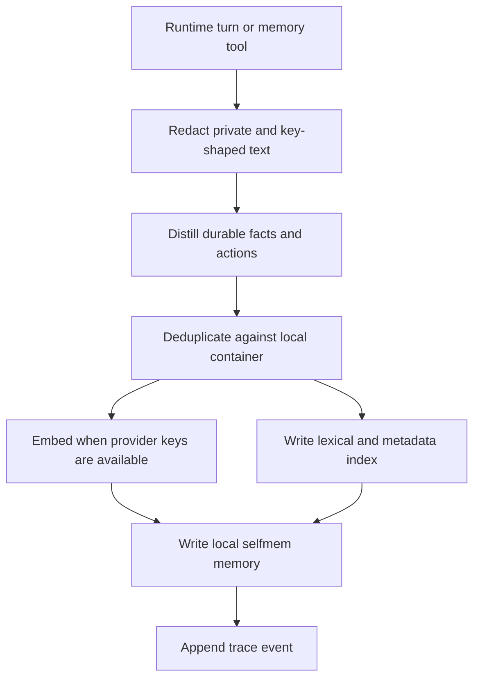
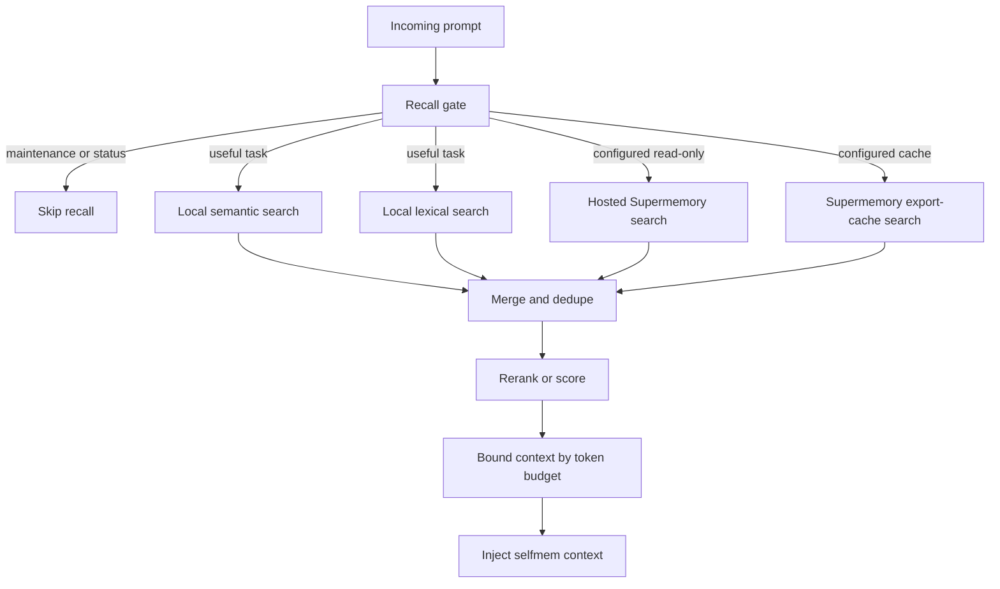
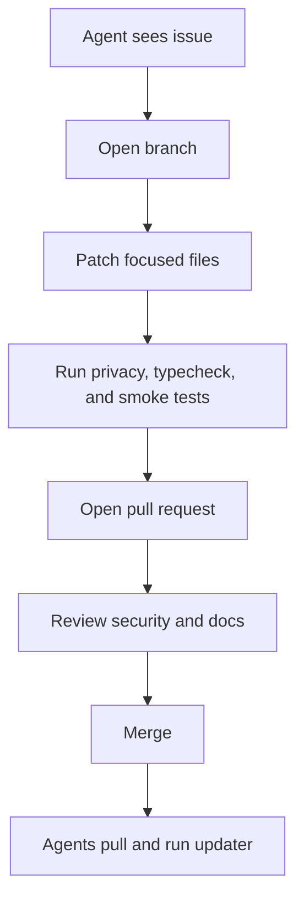
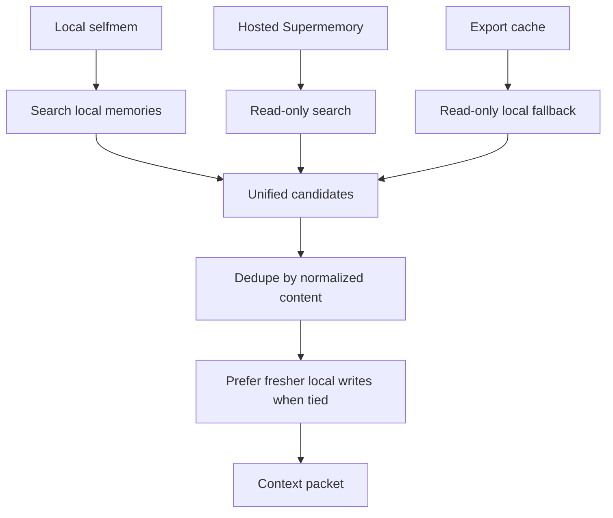

# Flows

## Write Flow

```mermaid
flowchart TD
  A["Runtime turn or memory tool"] --> B["Redact private and key-shaped text"]
  B --> C["Distill durable facts and actions"]
  C --> D["Deduplicate against local container"]
  D --> E["Embed when provider keys are available"]
  D --> F["Write lexical and metadata index"]
  E --> G["Write local selfmem memory"]
  F --> G
  G --> H["Append trace event"]
```

## Recall Flow

```mermaid
flowchart TD
  A["Incoming prompt"] --> B["Recall gate"]
  B -->|maintenance or status| C["Skip recall"]
  B -->|useful task| D["Local semantic search"]
  B -->|useful task| E["Local lexical search"]
  B -->|configured read-only| F["Hosted Supermemory search"]
  B -->|configured cache| G["Supermemory export-cache search"]
  D --> H["Merge and dedupe"]
  E --> H
  F --> H
  G --> H
  H --> I["Rerank or score"]
  I --> J["Bound context by token budget"]
  J --> K["Inject selfmem context"]
```

## Update Flow

```mermaid
flowchart TD
  A["Agent sees issue"] --> B["Open branch"]
  B --> C["Patch focused files"]
  C --> D["Run privacy, typecheck, and smoke tests"]
  D --> E["Open pull request"]
  E --> F["Review security and docs"]
  F --> G["Merge"]
  G --> H["Agents pull and run updater"]
```

## Supermemory Bridge

```mermaid
flowchart TD
  A["Local selfmem"] --> B["Search local memories"]
  C["Hosted Supermemory"] --> D["Read-only search"]
  E["Export cache"] --> F["Read-only local fallback"]
  B --> G["Unified candidates"]
  D --> G
  F --> G
  G --> H["Dedupe by normalized content"]
  H --> I["Prefer fresher local writes when tied"]
  I --> J["Context packet"]
```

Do not enable automatic Supermemory sync until a dry-run report shows safe, non-duplicate writes.
