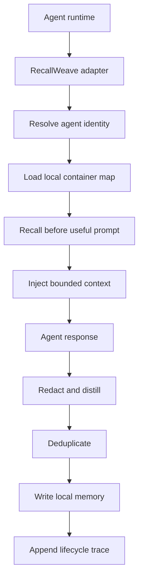
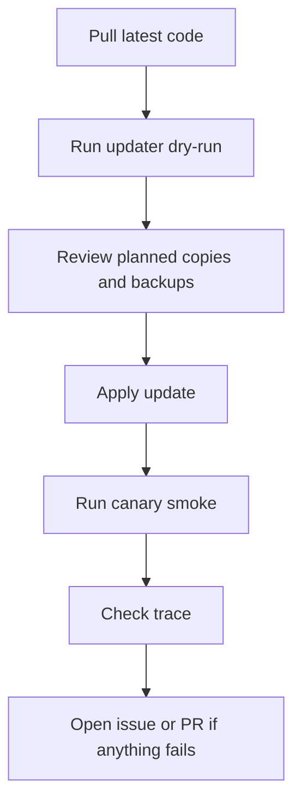
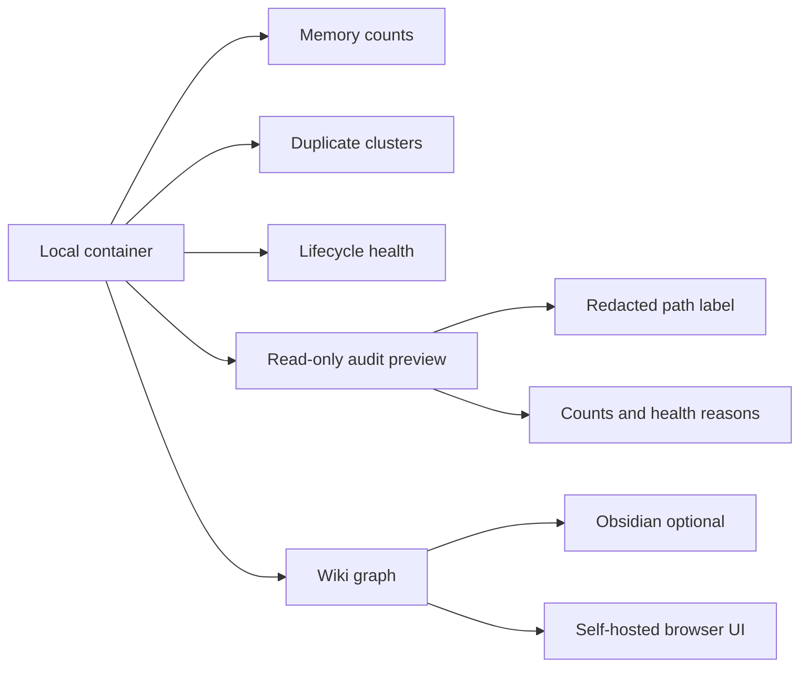

# Visual Guide

This guide shows the shape of RecallWeave without exposing any memory content.

## Native Memory Flow

## Hybrid Search Flow

```mermaid
flowchart TD
  A["User prompt"] --> B["Recall gate"]
  B --> C["Local semantic search"]
  B --> D["Local lexical search"]
  B --> E["Hosted Supermemory read-through"]
  B --> F["Export-cache read-through"]
  C --> G["Candidate merge"]
  D --> G
  E --> G
  F --> G
  G --> H["Dedupe"]
  H --> I["Rerank or score"]
  I --> J["Token-budget compiler"]
  J --> K["Context packet"]
```

## Update Flow

## Brain UI Direction

The Brain UI starts with fixture-safe views and a gated read-only selected
container audit:

The UI should never upload memory content by default.
